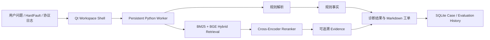

# Embedded Log RAG Diagnostic Workbench

面向 STM32F4 芯片手册、HardFault 现场和离线协议日志的本地 RAG 诊断工作台。

项目把“可以确定的规则事实”和“需要查资料的解释”分开处理：先解析寄存器、序列号、周期、长度和 CRC，再使用 BM25 + BGE + RRF + Cross-Encoder 从受控资料中检索证据，最后输出带来源的诊断建议。Qt 6 桌面端通过一个长驻 Python Worker 复用模型和索引，不在 C++ 中重复实现检索算法。

> 当前定位：可本地运行、可演示、可继续扩展的工程原型，不替代调试器、抓包工具或芯片厂商技术支持。

## 功能概览

- STM32F4 手册、CMSIS 头文件和文本资料的结构化切片与 metadata 保留。
- BM25 稀疏检索、BGE 向量检索、RRF 混合召回和 Cross-Encoder 重排序。
- 专家问答：返回 Grounded/拒答状态、来源、页码、章节、Chunk ID 和检索分数。
- HardFault 诊断：确定性解析 `CFSR/HFSR/BFAR/MMFAR/PC/LR`，再检索手册证据。
- 协议日志诊断：分析 UDP/TRDP 显式字段、序列、周期、长度和 CRC16。
- Qt 6 工作台：运行设置、健康自检、诊断工作区、案例库、知识源管理和评估中心。
- SQLite 案例与评估历史：支持筛选、重开、备注、收藏、候选审核和 Failed Cases。
- Evaluation Center：人工确认正确 Evidence 后计算 Hit Rate@K、Recall@K 和 MRR。
- Local Worker Protocol v1：Qt 与唯一长驻 Python Worker 使用 JSON Lines 通信。

## 系统结构



核心原则：

1. 寄存器和协议字段使用确定性代码计算，不交给 LLM 猜测。
2. 没有足够证据时明确拒答，不为了完整而编造结论。
3. helpful/unhelpful 和当前召回结果不会自动成为 ground truth。
4. 所有检索指标必须同时报告样本数和运行配置。

## 快速开始

### 1. Python 环境

推荐 Windows + Python 3.12。不要混用不同 Python ABI 创建的虚拟环境。

```powershell
py -3.12 -m venv .venv312
.\.venv312\Scripts\python.exe -m pip install -U pip
.\.venv312\Scripts\python.exe -m pip install -e ".[ml]"
```

`[ml]` 会安装 `sentence-transformers`，用于 BGE Embedding 和 Cross-Encoder Reranker。首次运行需要下载模型；之后可以使用 Hugging Face 本地缓存离线运行。

默认模型：

- Embedding：`BAAI/bge-small-zh-v1.5`
- Reranker：`BAAI/bge-reranker-base`

### 2. 准备 STM32F4 资料

由于版权和再分发限制，仓库不包含芯片手册 PDF、CMSIS 头文件或构建后的 Chroma 索引。请自行从授权来源获取资料，并按 `src/rag_diagnostic/profiles.py` 中的 `STM32_SOURCE_MANIFEST` 文件名放到：

```text
storage/stm32f4/
```

也可以使用本地 `资料/` 目录。两个目录都不会上传到 GitHub。

### 3. 建立索引

```powershell
.\.venv312\Scripts\python.exe -m rag_diagnostic `
  --root . `
  --embedding bge `
  --embedding-model BAAI/bge-small-zh-v1.5 `
  --reranker cross-encoder `
  --reranker-model BAAI/bge-reranker-base `
  stm32-ingest
```

### 4. 运行一次查询

```powershell
.\.venv312\Scripts\python.exe -m rag_diagnostic `
  --root . `
  --embedding bge `
  --embedding-model BAAI/bge-small-zh-v1.5 `
  stm32-query "ETH_DMASR 的 EBS 表示什么？" `
  --top-k 5
```

## HardFault 示例

```powershell
$hardFaultLog = Get-Content -Raw -Encoding UTF8 .\data\examples\hardfault_precise_busfault.log

.\.venv312\Scripts\python.exe -m rag_diagnostic `
  --root . `
  --embedding bge `
  --embedding-model BAAI/bge-small-zh-v1.5 `
  stm32-diagnose-log $hardFaultLog `
  --top-k 5
```

处理顺序：

```text
寄存器提取与 32 位校验
  -> CFSR/HFSR 位解码
  -> BFARVALID/MMARVALID 地址有效性判断
  -> 自动生成检索问题
  -> Hybrid Retrieval + Reranker
  -> 规则事实 + Evidence + Markdown 工单
```

## 协议日志示例

```powershell
$protocolLog = @'
2026-08-15T10:00:00.000Z UDP src=10.0.0.1:1000 dst=10.0.0.2:2000 seq=40 len=64
2026-08-15T10:00:00.025Z UDP src=10.0.0.1:1000 dst=10.0.0.2:2000 seq=42 len=64
'@

.\.venv312\Scripts\python.exe -m rag_diagnostic `
  --root . `
  --embedding bge `
  --embedding-model BAAI/bge-small-zh-v1.5 `
  protocol-diagnose-log $protocolLog `
  --profile udp `
  --expected-cycle-ms 10 `
  --jitter-tolerance-ms 2 `
  --expected-length 64 `
  --top-k 5
```

CRC16 只在用户显式选择 `modbus` 或 `ccitt_false`，且日志同时提供 `FRAME=<hex>` 与 `CRC=<hex>` 时执行。系统不会猜测多项式、字节序或 CRC 所在位置。

## Qt 6 桌面工作台

环境示例：Qt 6.8.3、MinGW 13.1、CMake 3.30、Ninja。

```powershell
& 'D:\Qt\Tools\CMake_64\bin\cmake.exe' `
  -S qt `
  -B qt\build `
  -G Ninja `
  -DCMAKE_PREFIX_PATH='D:\Qt\6.8.3\mingw_64'

& 'D:\Qt\Tools\CMake_64\bin\cmake.exe' --build qt\build

$env:Path = 'D:\Qt\6.8.3\mingw_64\bin;D:\Qt\Tools\mingw1310_64\bin;' + $env:Path
.\qt\build\RagDiagnosticWorkbench.exe
```

当前 Qt 页面：

- 诊断工作区：专家问答、HardFault、协议日志。
- 诊断案例库：本地 SQLite 历史、备注、收藏、导出和离线重开。
- 知识源管理：Source Manifest、文件/索引状态、chunks 和重建。
- 评估中心：Candidate 审核、Expected Evidence 编辑、正式样本、指标和 Failed Cases。
- Runtime Center：项目、Python、索引、Worker、Engine 和模型健康状态。

Windows 独立发布包将在 UI 定稿后生成；当前 `qt/build` 是开发构建目录，不是正式分发目录。

## Evaluation Center

评估闭环：

```text
诊断案例
  -> helpful / unhelpful 反馈候选
  -> 人工校对 query
  -> 选择、编辑或补充 Expected Evidence
  -> Approved Evaluation Sample
  -> 唯一 Worker 顺序检索
  -> Hit Rate@K / Recall@K / MRR / Failed Cases
```

当前仓库的少量评估问题只用于回归测试，不能代表生产环境准确率，也不能作为“90% 命中率”的依据。后续需要扩展人工标注、难负例、同名寄存器和相似故障样本。

## 测试

Python：

```powershell
.\.venv312\Scripts\python.exe -m unittest discover -s tests -v
```

Qt 构建与关键 smoke：

```powershell
& 'D:\Qt\Tools\CMake_64\bin\cmake.exe' --build qt\build

$env:Path = 'D:\Qt\6.8.3\mingw_64\bin;D:\Qt\Tools\mingw1310_64\bin;' + $env:Path
$env:QT_QPA_PLATFORM = 'offscreen'
.\qt\build\EvaluationStoreSmoke.exe
.\qt\build\EvaluationCenterPageSmoke.exe
.\qt\build\WorkbenchEvaluationSmoke.exe (Resolve-Path '.').Path
```

真实 Worker 回归：

```powershell
$env:HF_HUB_OFFLINE = '1'
$env:TRANSFORMERS_OFFLINE = '1'
.\qt\build\RagProcessBridgeSmoke.exe (Resolve-Path '.').Path
```

当前验收基线为 Python 61 项测试通过、Qt 全量构建通过、真实 Worker 输出 `BRIDGE_SMOKE_OK`。该数字表示代码回归测试数量，不是检索准确率。

## 项目目录

```text
RAG/
├── src/rag_diagnostic/       Python 检索、规则诊断、报告与 Worker
├── qt/                       Qt 6/C++17 桌面工作台和 smoke
├── data/raw/                 可公开的脱敏演示资料
├── data/examples/            脱敏日志样例
├── data/eval/                小规模人工评估样例
├── docs/user/                用户操作指南
├── docs/dev/                 开发者与架构指南
├── storage/                  本地资料、chunks 和 Chroma，不上传
├── reports/                  本地报告，不上传
└── tests/                    Python 回归与 Worker smoke
```

## 数据与安全边界

- 不提交未授权芯片手册、协议规范、模型缓存和 Chroma 索引。
- 不提交真实设备日志、内存内容、设备序列号、内网地址和业务标识。
- API Key 只通过本地环境变量或未跟踪的 `.env` 提供。
- SQLite 案例库、Markdown 报告和导出 JSON 共享前必须人工脱敏。
- LLM 生成的修复建议必须人工审查、编译和回归测试。

## 已知限制

- 不读取 PCAP，不监听网卡、串口、SWO、J-Link 或 GDB。
- 不解析 ELF/MAP，不自动执行 `addr2line`，不能唯一定位业务源码根因。
- TRDP 只解析日志中明确出现的文本字段，不实现完整二进制协议栈。
- 当前任务超时配置尚未执行强杀和自动恢复。
- 当前知识库重建是全量流程，尚未实现增量索引和版本回滚。
- Windows 正式 `dist`、安装后自检和最终 UI 截图仍在发布前收口阶段。

## 文档

- [用户快速上手](docs/user/getting-started.md)
- [架构与扩展指南](docs/dev/architecture-and-extension.md)
- [Qt 详细运行说明](qt/README.md)
- [GitHub 发布检查清单](docs/github-release-checklist.md)
- [贡献说明](CONTRIBUTING.md)
- [安全与数据处理](SECURITY.md)

## License

当前尚未选择开源许可证。在仓库加入明确的 `LICENSE` 前，不应默认获得复制、修改或再分发授权。首次公开上传前需要由项目所有者确认许可证。
