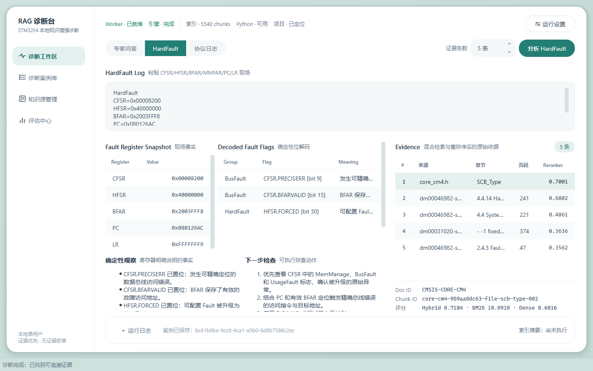
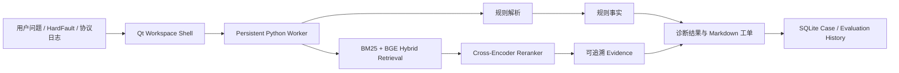
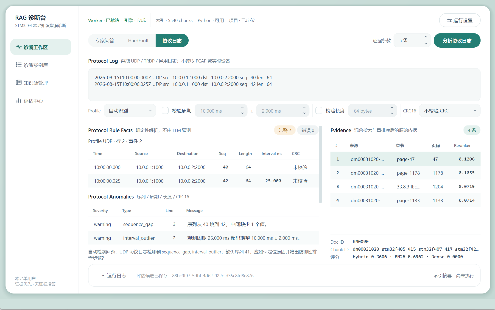
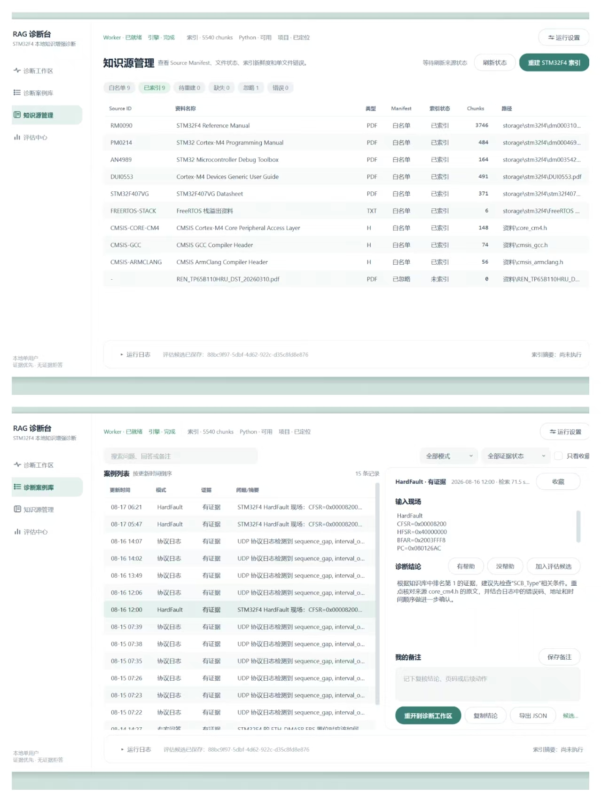
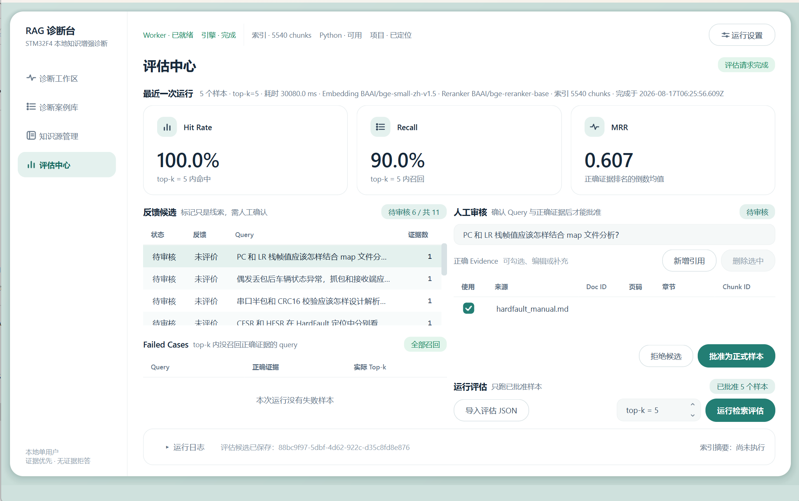

# Embedded Log RAG Diagnostic Workbench

### 面向嵌入式研发与故障排查的本地知识增强诊断工作台

开发者可以将 STM32 HardFault 寄存器现场、UDP/TRDP 协议日志或嵌入式技术问题输入工作台。系统先用确定性规则解析能够直接计算的事实，再从 STM32F4 手册、CMSIS 头文件和受控本地资料中检索相关依据，最后输出带来源的诊断结果、下一步排查建议和可复查的案例记录。

它解决的不是“把一个聊天框接上大模型”，而是把分散在寄存器现场、协议日志和技术手册中的诊断过程，整理成一条可追溯、可评估、可沉淀的工作流。



## 项目定位

嵌入式故障排查通常需要在异常现场、芯片手册、CMSIS 定义和通信日志之间反复交叉核对。直接依赖通用大模型，又容易出现寄存器含义错误、证据来源缺失或超出资料范围的问题。

本项目采用“规则诊断 + RAG 检索 + 人工评估”的组合方案：

- **规则负责确定事实**：寄存器位域、有效地址、序列号、周期、长度和 CRC 等内容由代码解析，不交给模型猜测。
- **检索负责补充依据**：对需要查阅手册和技术资料的部分，使用混合检索与重排序，并保留来源、章节、页码和 Chunk ID。
- **产品负责承接不确定性**：证据不足时明确拒答；诊断结果进入案例库，支持复查、标注和失败案例分析。

当前定位：可本地运行、可演示、可继续扩展的嵌入式诊断产品原型，不替代调试器、抓包工具或芯片厂商技术支持。

## 输入、处理与输出

| 输入 | 系统处理 | 输出 |
| --- | --- | --- |
| HardFault 寄存器现场 | 位域解析、地址有效性判断、手册证据检索 | 故障类型、确定性事实、证据来源和排查建议 |
| UDP/TRDP 离线日志 | 序列、周期、长度和 CRC 规则分析，检索相关资料 | 丢帧、周期异常、格式问题及关联证据 |
| 嵌入式技术问题 | BM25 + 向量混合召回、RRF 融合、Cross-Encoder 重排序 | 带章节、页码、Chunk ID 和检索分数的可溯源回答 |

## 核心产品能力

- **多场景诊断工作区**：支持专家问答、HardFault 现场分析和协议日志诊断。
- **受控知识库**：对 STM32F4 手册、CMSIS 头文件和文本资料进行结构化切片，并保留 metadata。
- **可追溯 Evidence**：展示来源文件、章节、页码、Chunk ID 和检索分数，方便人工复核。
- **案例与评估闭环**：保存本地诊断案例，支持筛选、备注、收藏、导出、Expected Evidence 审核和 Failed Cases 分析。
- **桌面化交互**：Qt 6 工作台提供运行设置、健康自检、知识源管理、Runtime Center 和 Evaluation Center。

## 一次诊断如何完成

```text
输入 HardFault 现场或协议日志
  -> 规则引擎提取可确定事实
  -> 根据异常摘要生成检索请求
  -> BM25 + BGE 混合召回
  -> RRF 融合与 Cross-Encoder 重排序
  -> 返回诊断事实、Evidence 与下一步排查建议
  -> 保存为案例并进入人工评估
```

## AI 边界与关键设计决策

1. **不让模型承担可以由代码确定的工作**：寄存器位和协议字段使用确定性逻辑计算，避免把基础事实交给生成式模型。
2. **回答必须能够回到资料**：诊断结果保留来源、章节、页码和 Chunk ID，用户可以从结论回查原始证据。
3. **证据不足时拒答**：系统不为了生成完整答案而补充未经验证的寄存器含义或修复建议。
4. **反馈不自动等于真值**：`helpful/unhelpful` 和当前召回结果只作为候选，Expected Evidence 必须经过人工确认后才能进入正式评估。
5. **指标必须带上下文**：Hit Rate@K、Recall@K 和 MRR 同时记录样本数与运行配置，避免把小规模回归结果包装成业务准确率。

## 系统结构



Qt 6 桌面端通过唯一的长驻 Python Worker 复用模型和索引，不在 C++ 中重复实现检索算法；Qt 负责工作台交互和状态呈现，Python 负责规则诊断、检索、重排序和结果编排。

## 快速开始

### 1. Python 环境

推荐 Windows 10/11 + Python 3.12。不要混用不同 Python ABI 创建的虚拟环境。首次安装机器学习依赖和下载模型需要稳定网络、足够的磁盘空间与内存；实际占用取决于 PyTorch、模型缓存和本地资料规模。

```powershell
py -3.12 -m venv .venv312
.\.venv312\Scripts\python.exe -m pip install -U pip
.\.venv312\Scripts\python.exe -m pip install -e ".[ml]"
```

`[ml]` 会安装 `sentence-transformers`，用于 BGE Embedding 和 Cross-Encoder Reranker。首次运行需要下载模型；之后可以使用 Hugging Face 本地缓存离线运行。

默认模型：

- Embedding：`BAAI/bge-small-zh-v1.5`
- Reranker：`BAAI/bge-reranker-base`

### 2. 准备 STM32F4 资料

由于版权和再分发限制，仓库不包含芯片手册 PDF、CMSIS 头文件或构建后的 Chroma 索引。请自行从授权来源获取资料，并按 `src/rag_diagnostic/profiles.py` 中的 `STM32_SOURCE_MANIFEST` 文件名放到：

```text
storage/stm32f4/
```

也可以使用本地 `资料/` 目录。两个目录都不会上传到 GitHub。

### 3. 建立索引

```powershell
.\.venv312\Scripts\python.exe -m rag_diagnostic `
  --root . `
  --embedding bge `
  --embedding-model BAAI/bge-small-zh-v1.5 `
  --reranker cross-encoder `
  --reranker-model BAAI/bge-reranker-base `
  stm32-ingest
```

### 4. 运行一次查询

```powershell
.\.venv312\Scripts\python.exe -m rag_diagnostic `
  --root . `
  --embedding bge `
  --embedding-model BAAI/bge-small-zh-v1.5 `
  stm32-query "ETH_DMASR 的 EBS 表示什么？" `
  --top-k 5
```

## 场景一：HardFault 现场诊断

```powershell
$hardFaultLog = Get-Content -Raw -Encoding UTF8 .\data\examples\hardfault_precise_busfault.log

.\.venv312\Scripts\python.exe -m rag_diagnostic `
  --root . `
  --embedding bge `
  --embedding-model BAAI/bge-small-zh-v1.5 `
  stm32-diagnose-log $hardFaultLog `
  --top-k 5
```

处理顺序：

```text
寄存器提取与 32 位校验
  -> CFSR/HFSR 位解码
  -> BFARVALID/MMARVALID 地址有效性判断
  -> 自动生成检索问题
  -> Hybrid Retrieval + Reranker
  -> 规则事实 + Evidence + Markdown 工单
```

## 场景二：协议日志诊断

```powershell
$protocolLog = Get-Content -Raw -Encoding UTF8 .\data\examples\protocol_udp_gap.log

.\.venv312\Scripts\python.exe -m rag_diagnostic `
  --root . `
  --embedding bge `
  --embedding-model BAAI/bge-small-zh-v1.5 `
  protocol-diagnose-log $protocolLog `
  --profile udp `
  --expected-cycle-ms 10 `
  --jitter-tolerance-ms 2 `
  --expected-length 64 `
  --top-k 5
```

该样例中序列号从 40 跳到 42，且两帧间隔为 25 ms。配置期望周期 `10 ± 2 ms` 后，规则引擎会分别报告 `sequence_gap` 和 `interval_outlier`，再用异常摘要检索相关手册证据。



CRC16 只在用户显式选择 `modbus` 或 `ccitt_false`，且日志同时提供 `FRAME=<hex>` 与 `CRC=<hex>` 时执行。系统不会猜测多项式、字节序或 CRC 所在位置。

## 产品工作台与桌面交互

环境示例：Qt 6.8.3、MinGW 13.1、CMake 3.30、Ninja。

```powershell
& 'D:\Qt\Tools\CMake_64\bin\cmake.exe' `
  -S qt `
  -B qt\build `
  -G Ninja `
  -DCMAKE_PREFIX_PATH='D:\Qt\6.8.3\mingw_64'

& 'D:\Qt\Tools\CMake_64\bin\cmake.exe' --build qt\build

$env:Path = 'D:\Qt\6.8.3\mingw_64\bin;D:\Qt\Tools\mingw1310_64\bin;' + $env:Path
.\qt\build\RagDiagnosticWorkbench.exe
```

当前 Qt 页面：

- 诊断工作区：专家问答、HardFault、协议日志。
- 诊断案例库：本地 SQLite 历史、备注、收藏、导出和离线重开。
- 知识源管理：Source Manifest、文件/索引状态、chunks 和重建。
- 评估中心：Candidate 审核、Expected Evidence 编辑、正式样本、指标和 Failed Cases。
- Runtime Center：项目、Python、索引、Worker、Engine 和模型健康状态。

知识源管理只接纳 Source Manifest 白名单资料，并展示文件、索引和 chunk 状态；诊断案例库保存本地结果快照，支持筛选、备注、收藏、导出和离线重开。



生成轻量 Windows 发布目录：

```powershell
& 'D:\Qt\Tools\CMake_64\bin\cmake.exe' `
  -S qt -B qt\build-release -G Ninja `
  -DCMAKE_BUILD_TYPE=Release `
  -DCMAKE_PREFIX_PATH='D:\Qt\6.8.3\mingw_64'
& 'D:\Qt\Tools\CMake_64\bin\cmake.exe' --build qt\build-release
.\tools\package-windows.ps1 -CreateArchive
.\dist\RagDiagnosticWorkbench\Launch-RagWorkbench.cmd
```

发布目录包含主程序和 Qt/MinGW 运行库，不包含 Python、模型、芯片手册和索引。启动器会从仓库中定位 `.venv312`；把发布目录单独复制到其他位置时，使用 `-ProjectRoot` 指向项目根目录。

## 评估闭环：验证检索质量

评估闭环：

```text
诊断案例
  -> helpful / unhelpful 反馈候选
  -> 人工校对 query
  -> 选择、编辑或补充 Expected Evidence
  -> Approved Evaluation Sample
  -> 唯一 Worker 顺序检索
  -> Hit Rate@K / Recall@K / MRR / Failed Cases
```

当前仓库的少量评估问题只用于回归测试，不能代表生产环境准确率，也不能作为“90% 命中率”的依据。后续需要扩展人工标注、难负例、同名寄存器和相似故障样本。



> 截图中的 Hit Rate、Recall 和 MRR 来自 5 条本地回归样本，只用于展示评估闭环和界面行为，不代表生产环境准确率。

## 测试

Python：

```powershell
.\.venv312\Scripts\python.exe -m unittest discover -s tests -v
```

Qt 构建与关键 smoke：

```powershell
& 'D:\Qt\Tools\CMake_64\bin\cmake.exe' --build qt\build

$env:Path = 'D:\Qt\6.8.3\mingw_64\bin;D:\Qt\Tools\mingw1310_64\bin;' + $env:Path
$env:QT_QPA_PLATFORM = 'offscreen'
.\qt\build\EvaluationStoreSmoke.exe
.\qt\build\EvaluationCenterPageSmoke.exe
.\qt\build\WorkbenchEvaluationSmoke.exe (Resolve-Path '.').Path
```

真实 Worker 回归：

```powershell
$env:HF_HUB_OFFLINE = '1'
$env:TRANSFORMERS_OFFLINE = '1'
.\qt\build\RagProcessBridgeSmoke.exe (Resolve-Path '.').Path
```

当前验收基线为 Python 61 项测试通过、Qt 全量构建通过、真实 Worker 输出 `BRIDGE_SMOKE_OK`。该数字表示代码回归测试数量，不是检索准确率。

## 项目目录

```text
RAG/
├── src/rag_diagnostic/       Python 检索、规则诊断、报告与 Worker
├── qt/                       Qt 6/C++17 桌面工作台和 smoke
├── data/raw/                 可公开的脱敏演示资料
├── data/examples/            脱敏日志样例
├── data/eval/                小规模人工评估样例
├── docs/user/                用户操作指南
├── docs/dev/                 开发者与架构指南
├── storage/                  本地资料、chunks 和 Chroma，不上传
├── reports/                  本地报告，不上传
└── tests/                    Python 回归与 Worker smoke
```

## 数据与安全边界

- 不提交未授权芯片手册、协议规范、模型缓存和 Chroma 索引。
- 不提交真实设备日志、内存内容、设备序列号、内网地址和业务标识。
- API Key 只通过本地环境变量或未跟踪的 `.env` 提供。
- SQLite 案例库、Markdown 报告和导出 JSON 共享前必须人工脱敏。
- LLM 生成的修复建议必须人工审查、编译和回归测试。

## 已知限制

- 不读取 PCAP，不监听网卡、串口、SWO、J-Link 或 GDB。
- 不解析 ELF/MAP，不自动执行 `addr2line`，不能唯一定位业务源码根因。
- TRDP 只解析日志中明确出现的文本字段，不实现完整二进制协议栈。
- 当前任务超时配置尚未执行强杀和自动恢复。
- 当前知识库重建是全量流程，尚未实现增量索引和版本回滚。
- Windows 发布包采用 source-assisted 模式，仍依赖已准备好的项目仓库和 `.venv312`，不是内置 Python 与模型的全离线安装器。

## 文档

- [用户快速上手](docs/user/getting-started.md)
- [架构与扩展指南](docs/dev/architecture-and-extension.md)
- [Qt 详细运行说明](qt/README.md)
- [Windows 打包与发布](docs/dev/windows-packaging.md)
- [GitHub 发布检查清单](docs/github-release-checklist.md)
- [版本记录](CHANGELOG.md)
- [GitHub 仓库信息建议](docs/github-repository-profile.md)
- [贡献说明](CONTRIBUTING.md)
- [安全与数据处理](SECURITY.md)

## License

当前尚未选择开源许可证。在仓库加入明确的 `LICENSE` 前，不应默认获得复制、修改或再分发授权。首次公开上传前需要由项目所有者确认许可证。
